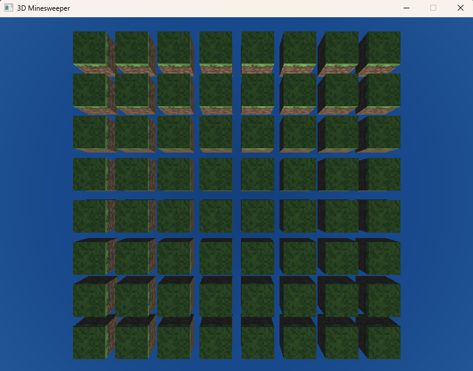

# 3D Minesweeper with skybox-based reflections

## Overview
This project implements a 3D version of the classic Minesweeper game using OpenGL for rendering. 
The game features a skybox for enhanced visual effects, including reflections on the minefield surface. 
Players can navigate a 3D grid, uncover cells, and avoid mines while enjoying a visually appealing environment.

## Features
- 3D grid-based gameplay similar to traditional Minesweeper.
- Skybox environment for immersive visuals.
- Reflective surfaces that mirror the skybox.
- User interaction through mouse and keyboard controls.
- Win/loss conditions with score tracking.

## Controls
- Mouse click to uncover cells.
- Right-click to flag/unflag cells.
- Mouse scroll to zoom in/out.
- WASD keys to navigate the camera around the minefield.
- R key to reset the game.
- Esc key to exit the game.
- Number keys (1-3) to adjust the difficulty level.
- Numpad keys (7-9) to change the camera angle.

## Installation
Ensure you have the following dependencies installed:
   - OpenGL
   - GLFW
   - GLM
   - GLEW
   - GLAD
   - STB Image
   - CMake
   - A C++ compiler (e.g., g++, clang++)

Compile the project using CMake:
```bash
mkdir build
cd build
cmake ..
make
```
Run the executable:
```bash
./3D_Minesweeper
```

## Screenshots
Start View:


Win View:


Loss View:
